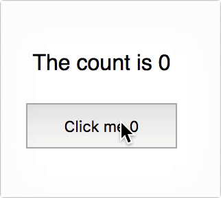

# Shared state component

A tiny global state management solution for React. (240 bytes gzipped, no api)

**DISCLAIMER**
This is probably a bad idea.

## API
Extend from `SharedStateComponent` instead of `React.Component`. Then use `setState` in your component just as you normally would in React. 

## Example



This minimal example shows how how to use SharedStateComponent. It should look pretty familiar if you have worked with react before. You can do anything you would do in React in here. 

The only difference from `React.Component` is that `this.state` will be shared between all instances of `CountState`.

`CountState.js` 
```js
import PropTypes from 'prop-types'
import SharedStateComponent from './SharedStateComponent'

export default class CountState extends SharedStateComponent {
  static propTypes = {
    render: PropTypes.func.isRequired,
  }
  state = {
    count: 0,
  }

  increaseCount = () => {
    this.setState(s => ({
      count: s.count + 1,
    }))
  }

  render() {
    return this.props.render(this.state, { increaseCount: this.increaseCount })
  }
}
```

You use `CountState` in your application just like you would use any other component. It will render all instances with the same `count` value.

`App.js`
```js
import React, { Component } from 'react'
import CountState from './components/CountState'

class App extends Component {
  render() {
    return (
      <div>
        <CountState render={({ count }) => `The count is ${count}`} />
        <CountState
          render={({ count }, { increaseCount }) => (
            <button onClick={increaseCount}>{'Click me ' + count}</button>}
          )
        />
      </div>
    )
  }
}

export default App
```
